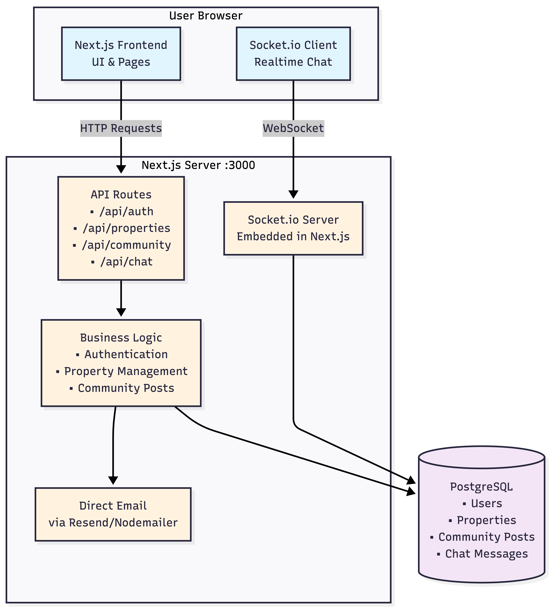
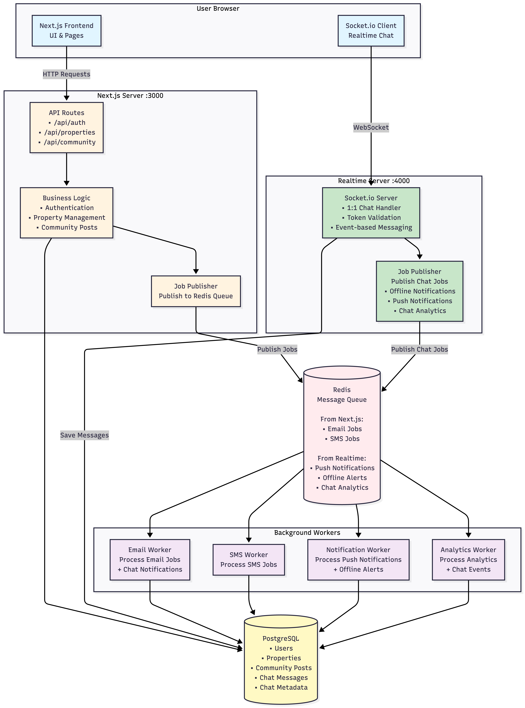

# FlatMate Architecture Overview

## TL;DR

FlatMate uses a **phased hybrid architecture**.  
The MVP is a **single Next.js–based modular monolith** for fast delivery.  
The final version evolves into a **distributed architecture** with a dedicated realtime server and background workers for scale and reliability.

---

## Architectural Approach

FlatMate follows an **evolutionary architecture** approach.

I start with a simple, unified system to minimize operational overhead and ship the MVP quickly. As requirements, traffic, and complexity grow, the architecture evolves into a more distributed model without requiring a redesign of core business logic.

This approach intentionally combines the strengths of **monoliths** and **microservices**.

---

## Version 1 — MVP Architecture

### What This Architecture Is

The MVP uses a **single Next.js server** that is responsible for:
- rendering the frontend,
- handling HTTP APIs,
- managing real-time chat via an embedded Socket.io server.

PostgreSQL acts as the single data store, and emails are sent directly from the server.

This version optimizes for **speed, simplicity, and development confidence**.

---

### MVP Architecture Diagram

---

### Example Flow (MVP)

**Chat message**
1. User sends a message via WebSocket
2. Next.js server receives and validates it
3. Message is saved to PostgreSQL
4. If the recipient is online, the message is delivered immediately

**User signup**
1. User submits signup form
2. User data is stored in PostgreSQL
3. Verification email is sent directly

---

### Why This Works for the MVP

- Single deployment
- Minimal infrastructure
- Faster iteration and debugging
- Lower operational complexity

---

### Accepted Limitations

- API and chat share the same process
- Emails are sent synchronously
- Limited scalability

These trade-offs are **intentional** at the MVP stage.

---

## Version 2 — Final / Scalable Architecture

### What This Architecture Is

The final architecture separates responsibilities into dedicated components:
- Next.js server for frontend and HTTP APIs
- Dedicated realtime server for chat
- Redis-based job queue
- Background workers for async tasks
- PostgreSQL as the system of record

This version is designed for **scalability, resilience, and clean fault isolation**.

---

### Final Architecture Diagram

---

### Example Flow (Final)

**Chat message**

**Fast path**
1. Message received by the realtime server
2. Message saved to PostgreSQL
3. Delivered instantly if the recipient is online

**Async path**
4. Realtime server publishes jobs to Redis
5. Workers handle notifications, emails, and analytics independently

---

### Why This Architecture Works at Scale

- Realtime traffic isolated from HTTP APIs
- Background tasks do not block user requests
- Components can scale independently
- Better observability and fault tolerance

---

### Trade-offs

- Higher infrastructure complexity
- More services to manage
- Redis becomes a critical dependency

These costs are justified only after the MVP proves value.

---

## Why This Is a Hybrid Architecture

FlatMate is neither a pure monolith nor full microservices.

- MVP behaves like a modular monolith
- Final version extracts high-impact components
- Business logic remains centralized
- Distribution is introduced only when needed

This reduces early risk while preserving long-term flexibility.

---

## Final Note

This architecture is designed to evolve with the product.  
Each phase optimizes for its constraints while keeping future growth practical and controlled.
